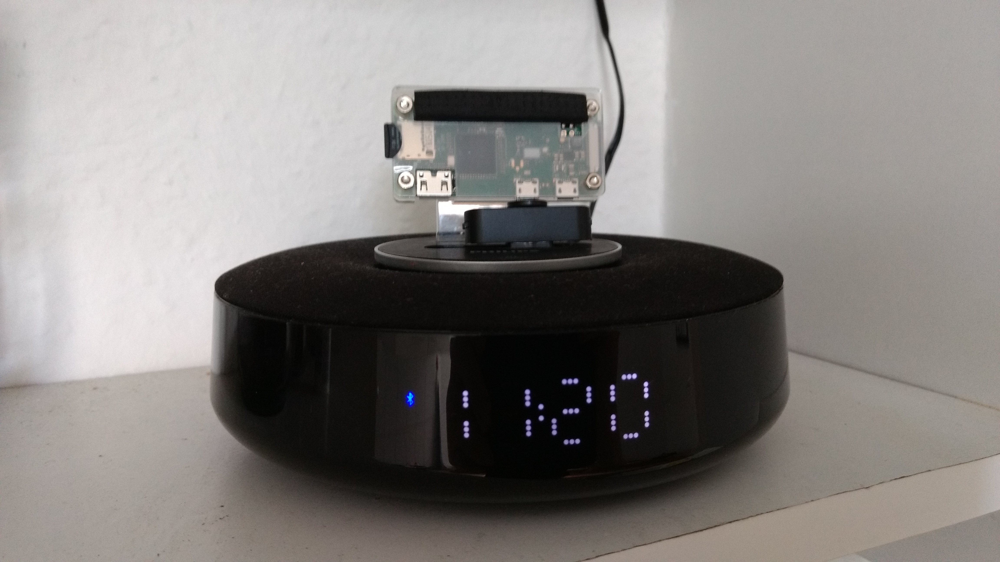

# Philips AS111 Linux Control
Script in order to control Philips A111/12 docking station

The Philips AS111/12 is a bluetooth speaker with clock and micro-usb port.

Usage:
```
$ as111.py

 USAGE:   as111.py <mac> [command1] [params] [command2] ...
 EXAMPLE: Set volume to 12
          $ ./as111.py vol 12

          Hacks and command queueing
          as111.py 00:1D:DF:52:F1:91 display 5 8765 countup 0:10 countdown 0:10 mins-n-secs 5

 sync                    Synchronizes time between PC and dock
 vol <0-32>              Sets volume to value which is between 0 and 32
 mute                    Sets volume to 0
 alarm-led <off|on>      Activates / deactivates alarm LED

 Hacks:
 mins-n-secs <secs>      Displays minutes and seconds instead of hour and minutes for <secs> seconds
 countdown <mm:ss>       Starts countdown
 countup <mm:ss>         Starts counting up
 display <secs> <number> Displays any 4-digit <number> for <secs> seconds
 sleep <n>               Hold processing for n seconds

 Other:
 info                    Prints device info
 json                    Prints device info in JSON format
 debug                   Activates debug mode
 help                    Information about usage, commands and parameters
```

## Pre-condition
Before you can use this script you must pair the device.

**Note**
On Ubuntu this script runs as expected after paring. But on Raspbian it was a hard to make it work since I've always got the error 'connection refused'.
I think that the following command make it work
```
sudo hciconfig hci0 sspmode 0
```

For PIN use 0000.

## API
You need to establish a RFCOMM connection via bluetooth. Port is 1. 

All requests follow the same schema. 

```
153 <length> <sequence no> <command> <payload> ... <checksum>
|   |        |             |         |             + see checksum
|   |        |             |         + payload, that depends on command
|   |        |             + Command, e.g. 17 in order to set time
|   |        + sequence number which identifies this request
|   + length of request incl. command, payload, checksum
+ static value, alwaws 153
```

Responses follow the schema of requests.

You should run the script by using the debug mode to see what is going over the air. 

```
DEBUG: Connnect to 00:1D:DF:52:F1:91
DEBUG: Connnected to 00:1D:DF:52:F1:91
DEBUG: request device name
DEBUG: >>> 153 3 1 8 248
DEBUG: <<< 153 8 1 9 65 83 49 49 49 207
DEBUG: device name is "AS111"
DEBUG: request device version
DEBUG: >>> 153 3 2 19 237
DEBUG: <<< 153 15 2 20 48 50 50 46 49 48 97 46 0 0 0 0 56
DEBUG: device version is "022.10a."
DEBUG: request current volume
DEBUG: >>> 153 4 3 15 0 241
DEBUG: <<< 153 5 3 16 0 12 225
DEBUG: current volume is 12
DEBUG: sync time to 2020-05-01 18:08:46
DEBUG: >>> 153 11 4 17 8 20 20 4 1 18 8 46 114
DEBUG: <<< 153 4 4 4 0 248
DEBUG: time synced
DEBUG: Set volume to 12
DEBUG: >>> 153 5 5 17 0 12 227
DEBUG: <<< 153 4 5 4 0 247
DEBUG: volume set to 12
DEBUG: Set volume to 12
DEBUG: >>> 153 5 6 17 24 1 214
DEBUG: <<< 153 4 6 4 0 246
DEBUG: volume set to 12
DEBUG: disconnect
DEBUG: disconnected
```

## Setup with Raspberry Pi Zero


There are two additional scripts so that the Philips AS111/12 turns into a internet radio receiver, i.e.

### omxplay

```omxplay``` is a little script that plays radio stations given in an xspf file, e.g. 

```
./omxplay Internetradio.xspf 917xfm
```

Plays the Hamburg music radio station 917xfm. Its URL is taken from *xspf playlist*. 

You can list all stations of *xspf playlist* as follows
```
./omxplay /home/heckie/Daten/Musik/Internetradio.xspf -l
 104.6 RTL
 1Live
 89.0 RTL
 917xfm
 Absolut Relax
 Alsterradio
 Alternativ FM
 Antenne 1 Stuttgart
 Antenne Bayern
 Antenne Bayern Chillout
...
 Deutschlandfunk
 Deutschlandfunk 24
 Deutschlandfunk Kultur
 Deutschlandfunk Nova
...
 You FM
```


Run ```./omxplay -t``` in order to stop *omxplayer*.


### as111_play

The script ```as111_play``` sychronizes time with Philips AS111/12 before playing music by using ```omxplay```